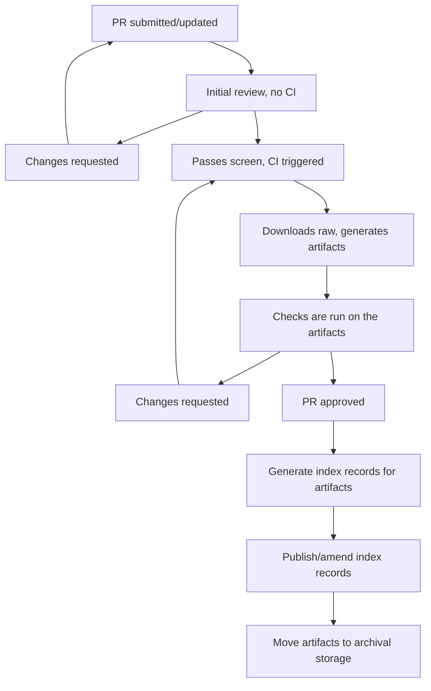

```mermaid
graph TD;
    S[PR submitted/updated]-->R0[Initial review, no CI];
    R0-->C0[Changes requested]-->S;
    R0-->A0[Passes screen, CI triggered];
    A0-->G[Downloads raw, generates artifacts];
    G-->CI[Checks are run on the artifacts];
    CI-->C1[Changes requested]-->A0;
    CI-->A1[PR approved];
    A1-->R[Generate index records for artifacts];
    R-->P[Publish/amend index records];
    P-->M[Move artifacts to archival storage];
```

